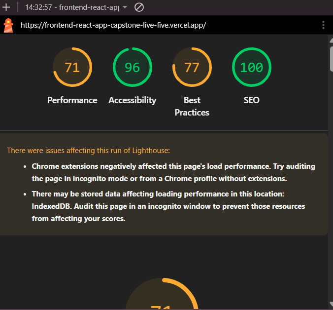

## Github link
[https://github.com/BigguyFM98000/frontend-react-app-capstone](https://github.com/BigguyFM98000/frontend-react-app-capstone)

## Setup & Run
Install the dependencies and start the development server with one command:

npm install && npm run dev

Then open [http://localhost:5173](http://localhost:5173) in your browser.

## Architecture overview: what does each part do?
1. Welcome Page 
- Its an entry page of the application with the name of the application and its slogan.

2. Login Page
- Its the authentication page that allows users to login using their email and password or use their google email accounts.
- It also has a link to reset your password and a link to the register page.

3. Register Page
- New users to the application can use this page to register to the application.

4. Forgot Password Page
- It a registered user happens to forget their password they can use this page to reset it by providing their registered email address.

5. Dashboard Page
- It shows all the expenses that you have added or a message showing no expenses added.

6. Add Expense Page
- A user is routed after pressing Add Expense button to this page inorder to add a new expense.
- To add an expense you enter its amount, category and date.

7. Update Expense Page
- A user is routed to this page after clicking the Update button on the dashboard and they can update their expense.

8. Help Page
- This page is for contacting me the developer if you happen to face any issues while using the application and its only available to logged in users.

9. Profile Page
- Its a mini profile of the logged in user and it also shows your google profile picture if you signed in using your google account.

10. Not Found Page
- This page is the page that is loaded if the route that the user navigates is not definced in the application.

## AI integration explained
1. How does Claude/LLM fit? 
- I used Github copilot for this application to troubleshoot any issues while coding and also to write tests for each component.
2. What prompt?
- I did not note the prompts I used but they were directed at error messages I was getting on the developer tools.
3. Why?
- Its my first time using React to build a web application and I was learnig as I go if I happen to encounter an error I did not understand thats when I asked Copilot to fix it.

## Known limitations & future improvements
1. Known Limitations
- Is that copilot is good at writing code and solving bugs but I am still the developer and have a basic understanding of whats going on under the hood.
2. Future Improvements
- A new styling framework such a Material UI to give the application a cool interface.

## Testing Evidence
Test Files 1 passed (10)
      Tests 9 passed (16)
   Start at 13:18:44
stdout | src/test/UpdateExpensePage.test.jsx > UpdateExpensePage > displays an error when updating fails
Error while updating:  Unable to update expense

 ✓ src/test/UpdateExpensePage.test.jsx (4 tests) 869ms
     ✓ loads an owned expense into the update form  569ms

 ❯ src/test/DashboardPage.test.jsx 6/6
 ❯ src/test/LoginPage.test.jsx 2/6
 ❯ src/test/UpdateExpensePage.test.jsx 4/4

 Test Files 2 passed (10)
      Tests 12 passed (16)
   Start at 13:18:44
stdout | src/test/LoginPage.test.jsx > LoginPage > displays a Google sign-in error without navigating
Google sign-in failed

## Performance & accessibility audit
1. Lighthouse Scores

2. One concrete improvement you made based on audit findings.
- SEO - 100%
- Accessibility - 96%
- Best Practices - 77%
- Performance - 71%
- Improvement - Need to optimize the application for shorter loading times.

## Deployment & operation
1. Vercel Hosting Provider (https://frontend-react-app-capstone-live-five.vercel.app/)
2. Hosted from the GitHub repository (https://github.com/BigguyFM98000/frontend-react-app-capstone)

## How does it fail safely?
- All the error messages are printed on the user interface for the user and the use of trycatch allows the application to continue even after encountering an error.

## Rollback plan or monitoring setup documented
- Any changes that need to be made to the application will be edited on the Github repository created by Vercel and this action triggers an automatic redeployment of the application.

# Reflection
1. What was hardest?
- The hardest part was understanding the code for testing the application.
2. Why?
- Because it was my first time working with tests during dvelopment.
3. What would you do differently next time?
- I would first learn testing and how to implement testing in react so that I could be better equaped to write test cases myself.
4. One thing you learned that surprised you.
- That I am capable and able to deliver a full stack application end to end with the help of course of AI.

